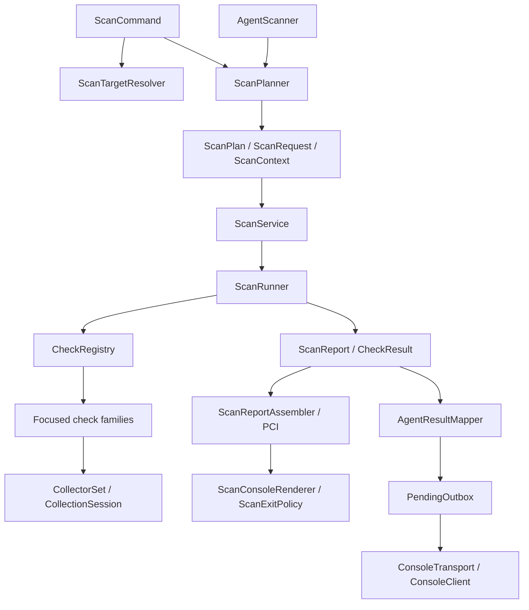

# Magebean CLI architecture after phases 1–6

This is an incremental refactor, preserving command options, bundled rules,
ordinary output/exit behavior and agent transport schema. The phase 1 frozen
baseline is still authoritative for behavior; it was not regenerated.

## Application flow

`ScanCommand` owns Symfony input/output and orchestration only. Target resolution,
URL validation, Magento detection and base-URL discovery live in
`ScanTargetResolver`; `ResolvedScanTarget` creates the canonical context.
`ProjectPath` centralizes the unchanged filesystem and project-file path policy.

`ScanPlanner` retains separate CLI and agent selection policies, returning immutable
plans. It emits `ScanDiagnostic` objects with plain label/detail/level segments;
only `ScanConsoleRenderer` generates console formatting. The diagnostic callback
is an internal application boundary introduced during these phases; it now receives
the object rather than a formatted string. The command's output remains identical.

`ScanService` and `ScanRunner` manage execution, observations, progress, collection
scope and optional deadlines. `ScanReportAssembler` attaches legacy metadata, PCI
evidence/readiness extensions and remote coverage information, preserving typed
observations and extension fields. PCI file writing retains its original options,
ordering, formatting and permissions policy. `ScanExitPolicy` decides the existing
0/1/2 exit codes without importing Symfony.

`ScanConsoleRenderer` owns summary, rule detail, manual/inconclusive guidance,
progress presentation and PCI summary. Its legacy environment display still reads
PHP configuration as before. The disabled HTML-template implementation and
unreachable command return were removed; HTML export remains disabled.

`AgentScanner` orchestrates planning/execution; `AgentResultMapper` retains result
mapping, redaction, evidence limits, titles and timestamps. TickRunner retains tick,
heartbeat/lease and self-update orchestration. Durable delivery belongs to
`PendingOutbox`, behind `ConsoleTransport`. Narrow private wrappers remain where
existing reflection-based tests/callers used renderer/title helpers.

## Check families and compatibility facades

`ComposerCheck` and `CodeSearchCheck` remain explicit public facades. Their public
method names, argument names/types and return types are frozen in
`tests/fixtures/architecture/check-api.json`. Dispatch uses explicit method calls,
not magic methods or string-based routing. The same mutable legacy context and
collector set are shared with each family.

| Source families | Responsibility |
| --- | --- |
| CodeQueryChecks | Generic grep and configured HTTP/mixed-content endpoints |
| PaymentSourceChecks | Cardholder data and checkout/payment evidence |
| AuthorizationSourceChecks | Authorization, API exposure, downloadable data, executable media |
| DataProtectionSourceChecks | Secrets, XML, PII, logging and integration scope |
| InputSafetySourceChecks | SQL, SSRF, execution, paths, uploads and random generation |
| TemplateRequestSourceChecks | Template escaping, form protection and webhook verification |

| Composer families | Responsibility |
| --- | --- |
| ComposerAdvisoryChecks | Advisory, Adobe patch, fix-version, KEV and transitive checks |
| ComposerRepositoryChecks | Vendor support, abandoned packages and repository health |
| ComposerVersionChecks | Yanked/outdated packages and marketplace versions |
| ComposerPolicyChecks | Lock/JSON integrity, constraints, matching and risk-surface policy |

`CodeSearchSupport` and `ComposerSupport` hold shared protected primitives;
family-specific helpers stay private in their owning family. Existing detector
method implementations were verified against pre-extraction source, with only
private-to-protected visibility changes for shared helpers. Existing imperfect
heuristics and the historical broken Composer alias were deliberately retained.

At phase 6 start, ScanCommand had 1,380 lines, ComposerCheck 6,145 and
CodeSearchCheck 5,248. Their final adapters/facades have 276, 202 and 223 lines.
Code is split by responsibility rather than removed; renderer and families own
the implementation. Line counts do not by themselves establish improved runtime.

## Validation and operational boundaries

- `php tests/run.php`: 51/51 pass, including CLI/agent baseline, rule/profile counts,
  PCI workflows, collectors, deadlines, outbox recovery and architecture API guards.
- Phase 1 baseline SHA-256 remains
  `a638b0b6e79506a32410cf4347cd66a07f05f9bf9ac21ae69858cc7fb863556c`.
- New classes use the existing PSR-4 `Magebean` autoload and existing Box source
  directories. No dependency, rule, binary entrypoint or packaging config changed.
- Syntax/diff checks pass. Validation used PHP 8.4.24; PHP 8.1 was not available for
  a separate runtime execution. Source additions use PHP 8.1-compatible constructs.
- No production scans, external server mutations, commits, PHAR build or deployment.

The six migration phases are complete. This does not certify that all QA findings
or original architectural risks are fixed. Detector false positives/negatives and
rule mappings remain a separate behavior-changing workstream. Executable target
configuration is not sandboxed. General check exceptions still propagate; only
cooperative deadline exceptions become UNKNOWN. Legacy subprocess/API calls are
not all supervised by a hard deadline. Local observations are per-scan snapshots,
not an atomic deployment snapshot. Pending corruption/permanent rejection retains
data and can block subsequent claims; exactly-once delivery depends on the server.
These boundaries are intentional to preserve existing behavior and are detailed
in `scan-collectors.md` and `scan-reliability.md`.
