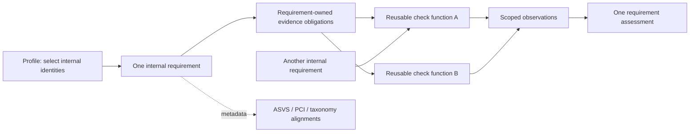

# Internal requirement and reusable-check model

One rule is one internal requirement. A requirement owns its identity, criterion, revision, applicability, evidence obligations and assessment. It can reuse multiple checks; a check is an independently registered function that produces scoped observations, not a nested rule or another requirement.

## Identity and catalog authority

The primary identity is `MB-…`. It is independent of ASVS, PCI DSS and OWASP taxonomy numbering. Standard references are **alignment metadata**; identical numeric citations across standards are not identity equality. A shared detector or standard citation does not establish semantic equivalence between requirements.

`RequirementCatalog::loadAll()` reads the persisted primary catalog. `RequirementCatalog::forProfile(name, capabilities, mode)` selects the same definitions through profile membership and context. Profiles must not define assessment logic, duplicate criteria, attach a legacy mapping to create a requirement, or silently strengthen or weaken an obligation. ASVS introduced level and the selected assessment level remain distinct metadata.

Definitions use `id`, `revision`, `criterion`, `alignments`, `coverage`, `applicability` and requirement-owned `obligations`. Each obligation names registered check functions and explicit arguments. `checks` is a flattened validation/inspection view, not a second source of assessment logic. Primary definitions do not have `requirements[]`, `legacy_rule_ids`, or a dependency on the MB-R catalog. Legacy aliases and historical mappings belong to a compatibility adapter.

## Evidence logic

A necessary obligation uses AND with other necessary obligations. OR is allowed between complete accepted alternatives for the same obligation. Checks that only support a conclusion are not substituted for mandatory proof. Mandatory human judgment cannot be bypassed by a technical alternative.

Each obligation records its role (`mandatory` or `supporting`) and proof classification (`verified_predicate`, `heuristic`, or `human`). These declarations constrain evaluation; they do not certify an old detector's accuracy. A verified technical violation of a necessary predicate can establish FAIL. A heuristic match, file presence or absence, regex scan or configuration hint remains evidence requiring confirmation when it does not prove the criterion. Supporting observations alone cannot establish PASS.

PASS requires sufficient evidence for the entire applicable criterion. UNKNOWN indicates missing or indeterminate necessary evidence. MANUAL_REVIEW indicates unresolved required human judgment. Coverage describes implementation capability and is separate from the outcome of one scan. Missing implementation, inaccessible scope, unavailable credentials and disabled capability are not evidence of compliance or non-applicability.

The retained outcome vocabulary has no independent certified NOT_APPLICABLE result. Applicability context and its limitations must remain visible; omitted contextual execution does not demonstrate a verified exclusion from assessment scope.

## Inventory and profiles

Count primary requirement identities once. Count standard references, check functions, legacy aliases and execution variants separately. ASVS level inheritance selects existing identities rather than making copies. OWASP Top 10 categories are taxonomy tags, not ten atomic requirements. External checks are target-mode variants and do not create another requirement identity merely because they execute remotely.

The ASVS and PCI registries contain 345 and 280 version-qualified standard criteria. Their 625 reference identities are not the complete internal inventory and do not prove cross-standard semantic equivalence. Existing Magento-specific predicates need explicit internal criteria. Migration decisions must retain unresolved criteria and human evidence gaps.

## Compatibility boundary

Technical names `rules:list`, `--rules`, `--exclude-rules`, `rules` and agent `rule_key` remain until a separately approved interface deprecation. Normal listing and selection use internal identities. Explicit historical MB-R selections and manifests remain adapter requests, with historical result IDs and behavior.

Historical source definitions are compatibility fixtures, not extra primary inventory entries. One-to-many aliases require explicit expansion semantics; exclusions cannot remove required evidence while preserving a misleading PASS. Physical deletion of compatibility sources requires proving all consumers have migrated.

Persisted definitions carry `alignments` entries with `standard`, `version`, `reference` and `relationship`. Primary findings carry a singular `requirement` object (`id`, `revision`, `criterion`) and an `alignment` array preserving those entries. PCI reporting reads PCI version-qualified alignment on primary findings; only historical findings use `profile.mappings`. JSON preserves these fields; SARIF retains them in properties. Report counts distinguish assessments from checks and standards references.

Agent transport envelope shape and deployed dashboard acceptance are separate compatibility claims. New internal IDs require dashboard catalog/assessment-item coordination and exact manifest result cardinality; preserving JSON keys alone is insufficient. UNKNOWN and MANUAL_REVIEW remain wire `error` under schema 1.0.

## QA and proof limits

The security team ledger provides per-entry metadata triage, not signed-off criterion verification. The persisted migration must retain that distinction: rearranging definitions cannot automatically promote partial evidence to complete automation. Reviewers must assess sufficiency, true alternatives, input scope, false positives, false negatives and human gates for each internal criterion. Future runtime-changing checks require an explicit authorized scenario runner rather than passive-scan configuration changes.

Historical phase and QA reports remain records of their original interfaces and counts. See [migration contract](requirement-migration.md), [native evidence scope](asvs-native-evidence.md) and [PCI workflow](pci-dss-v4.0.1-workflow.md).

## Semantic consolidation and redirects

Requirements may be consolidated only after criterion-level review establishes equivalent scope or approves an explicit combined criterion that retains every necessary clause. Shared check functions, matching observations, standard references or similar titles are insufficient evidence for a merge. The combined definition preserves original standard-scoped criteria, applicability restrictions, exceptions, assessment levels and provenance in its alignment metadata. Combining criteria does not approve the associated detectors or promote heuristic evidence to verified proof.

A surviving internal ID keeps its identity and increments its revision when the criterion changes. Retired IDs remain in the immutable allocation history and resolve through the alias registry; they are never recycled. Built-in and custom profile membership resolves retirements and deduplicates canonical IDs. Standard reference counts remain separate from the number of active internal requirements.

CLI selectors and policy exclusions resolve retired internal IDs to the surviving requirement before execution. Selecting both IDs produces one canonical assessment. An agent manifest keeps an ordered binding for each requested key and assessment item. Several distinct keys may bind to the same canonical assessment; execution occurs once and the transport emits one result for each requested binding. Exact duplicate internal keys remain invalid. Transport evidence retains the canonical requirement identity while `rule_key` retains the requested key. Summary totals count canonical assessments, so they may differ from the number of transported results.

Observation reuse stays within one scan invocation and the same target, function arguments and collection scope. Reusing an observation does not reuse a compliance conclusion. Different thresholds, scope arguments, obligations, proof classes or human gates remain independently evaluated. Missing applicability context and local-only evidence do not become PASS or verified non-applicability after consolidation.

## Basic deployment automation profile

Basic now selects twenty reviewed automated deployment predicates with no human obligations. It uses MB-0728/0729/0730 for observed admin-password policy, declared project debug flags, and deployed working-tree pattern scanning. Broad ASVS MB-0209/0379 and Git-history MB-0072 remain unchanged outside basic. Other profile memberships, including the 684-entry baseline assessment profile, remain unchanged to avoid selecting both representations and duplicating findings. The global inventory is 687 identities; historical allocations730, next ID731, all625 standard references preserved.

Basic marks missing/invalid collection as execution errors, scan_complete=false and exit3; its console has no INCONCLUSIVE or human-review section. Internal UNKNOWN remains compatible with existing transport; classification=execution_error and execution_status=ERROR explicitly distinguish incomplete execution from policy violations. Existing security exit codes0/1/2 remain unchanged for completed scans. This policy does not convert missing evidence to PASS or security FAIL.
