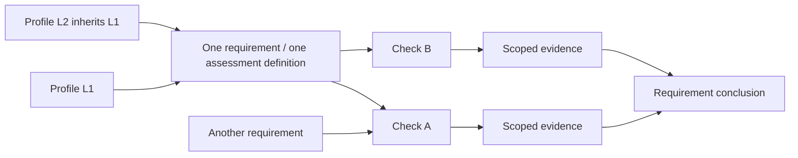

# Requirement assessment model

Status: implemented for ASVS profiles L1/L2/L3 through a compiled requirement catalog. Legacy MB-R definitions remain evidence sources and compatibility adapters. Other standards and baseline profiles have not been converted. See [runtime migration](requirement-migration.md).

## Terminology and identity

A **requirement** is the unit selected for assessment, assigned a conclusion and shown in a report. A **rule** is the legacy technical name for its executable definition. In the target model, **one rule represents exactly one requirement, and one requirement has exactly one assessment definition**. New product prose uses “requirement”. This does not mean every existing MB-R entry already satisfies the target mapping.

A **check** is a reusable evidence-producing operation. A requirement can contain multiple checks; the same check implementation can be used by multiple requirements with explicit arguments and scope. Sharing an implementation does not share a requirement conclusion. A **control** groups requirements. A **profile** selects requirement identities and assessment parameters rather than creating duplicate definitions. **Evidence** is an observation with a source, scope, time and limitations; evidence is not itself a compliance conclusion.

For standard-backed requirements, identity must include **standard + version + requirement ID**. ASVS 5.0.0 6.2.1 and PCI DSS 4.0.1 6.2.1 are different identities. Canonical spelling: `OWASP-ASVS:5.0.0:6.2.1`. The CLI accepts this selector with an explicit ASVS profile to establish the assessment level. Magento baseline requirements need their own namespace and criteria; they must not be silently equated with an ASVS requirement because a check is useful to both.

## Legacy adapter versus requirement model

| Concern | Current implementation | Target definition |
|---|---|---|
| Catalog identity | MB-Rxxx legacy rule ID | Versioned requirement identity; legacy mapping retained during migration |
| Standards mapping | A legacy rule may map to multiple requirements; a requirement may have several rules | Exactly one assessment definition per requirement; legacy evidence checks are composed beneath it |
| Profile entries | Legacy rule selections plus requirement coverage metadata | Unique requirement selections, inherited without duplication |
| Execution | Rule contains checks and op:all/any | Requirement definition contains explicit predicate groups, checks and evidence obligations |
| Result | Legacy findings keyed by rule IDs and check details | One conclusion per requirement, with check observations and coverage gaps |
| Public interface | rules:list, --rules, --exclude-rules, JSON rules and MB-R IDs | Terminology migration later; existing command names and transport fields remain; canonical selectors are supported for ASVS |

The existing catalog has **371 legacy rule definitions**, not 371 unique standards requirements. ASVS profiles compile **70 L1 requirements** and **253 cumulative L1+L2 requirements**, including unsupported requirements. These are requirement counts, not execution counts. The original automation review identifies 110 non-contextual human-required requirements plus 55 capability-dependent requirements. This migration changes assessment grouping, not automation coverage.

## Combining checks into a conclusion

Define the requirement's logical obligations before choosing checks:

1. Conditions that are all necessary use AND. A password-change requirement can require current-password verification, acceptance of the new password and correct server-side enforcement together.
2. OR is allowed only between explicitly accepted, complete alternative implementations of the **same obligation**. It cannot join unrelated signals, or allow a technical PASS to bypass required human evidence.
3. Shared evidence and alternative observations must be attached to the proper obligation. A failing observation of an unused alternative is not automatically a requirement failure. A proven failure of a necessary condition can establish FAIL; legacy partial detectors remain signals requiring confirmation, and missing technical evidence remains UNKNOWN; unresolved alternatives cannot establish either PASS or FAIL by themselves.
4. PASS requires all applicable obligations to be satisfied with adequate evidence and scope coverage. Sampling, file presence, an unobserved path or no regex matches are not proof of absence across the requirement's scope.
5. UNKNOWN means necessary technical evidence is missing, unavailable or indeterminate. MANUAL_REVIEW means required human judgment has not been supplied or independently accepted. A partial automated PASS leaves the broader requirement unresolved.
6. Non-applicability requires affirmative scope/capability evidence and a rationale. Missing credentials, URL, adapter or capability information is not evidence that a requirement is inapplicable. A future requirement-level non-applicable outcome must not be claimed to exist already in the legacy engine.

Required check metadata should identify the predicate addressed, target scope, evidence source, effective configuration or runtime observation, acquisition time, limitations and missing coverage. Credentials and raw secrets must not appear in evidence. Human evidence should identify the reviewer, relevant scope, assessment time, supporting references and rationale, with freshness requirements appropriate to the criterion. These are target evidence contracts; they are not new fields accepted by current loaders.

Coverage (**AUTOMATED**, **PARTIALLY_AUTOMATED**, **MANUAL_REVIEW**, **CONTEXT_REQUIRED**, **NOT_YET_COVERED**) describes how a requirement can be assessed. Outcome (**PASS**, **FAIL**, **UNKNOWN**, **MANUAL_REVIEW**) describes a particular scan/assessment. They must not be conflated. A requirement with no implementation remains in the inventory with a coverage gap; no fake passing check should be inserted to make the count complete.

## Inheritance and profiles

L2 inherits L1 requirement definitions by canonical identity. Higher-level constraints may tighten a predicate or its assessment parameters, but must not create a second copy of the same requirement or reuse a weaker L1 PASS as evidence for an untested L2 obligation. Profile membership and requirement coverage are deduplicated separately from check execution counts.

Capability-dependent requirements are activated by confirmed context. Requirements referring to LDAP, OAuth/OIDC, native code or WebRTC are not assumed applicable to every Magento installation. A check may execute once and yield reusable observations where scope and freshness permit; each requirement independently evaluates whether those observations prove its predicate.

## Migration sequence and compatibility

1. Freeze the terminology and target contract in this document. Inventory each standard/version/requirement, current mappings, coverage and evidence obligations. See [ASVS L1/L2 migration inventory](asvs-requirement-migration.md).
2. Split legacy rules mapping several requirements into separate assessment definitions. Merge evidence from several legacy rules supporting one requirement beneath its one definition. Preserve full criteria, severity decisions, applicability, manual scope and evidence lineage; a shared technical detector remains a check rather than a substitute requirement.
3. Assign canonical requirement identities and make legacy-ID resolution explicit. A legacy MB-R ID may expand to multiple target requirements after a split; several legacy IDs may point to the same requirement after a merge. Do not promise a one-to-one alias or silently drop part of an old selection. Validate unsupported/ambiguous targets and retain unresolved coverage.
4. Migrate profiles, exclusions, project policy, report counters, details and agent assessment mappings together. A dashboard rule_key or assessment_item_id cannot be renamed independently of the dashboard contract. The implemented agent adapter preserves schema 1.0 and legacy manifests; canonical manifests require profile context and dashboard catalog alignment.
5. Verify both interfaces on equivalent fixtures: selection, inherited membership, scopes, human review, evidence details, intentional aggregation differences and exit behavior. Compare requirement counts separately from legacy rule and check counts. Keep an issue-specific migration ledger for intentional changes.
6. Publish a deprecation plan before removing legacy CLI/config/wire names. No removal is performed by this documentation change.

Reclassification does not make automation evidence sufficient automatically. The earlier ASVS feasibility review identified 31 non-contextual scoped automation candidates and 59 candidates for new partial evidence, not 31 new rules or checks already implemented. Runtime-changing tests need an explicit staging scenario runner and opt-in; they are not added to the default passive scan by changing a definition.

## Documentation conventions

- Use **requirement** for the product assessment unit, **check** for evidence operations and **legacy rule** for existing MB-R mappings/interfaces when ambiguity matters.
- Preserve exact executable names, JSON keys, source class names, IDs, standard citations and command examples until implementation changes them.
- Tables must label whether a count is requirements, legacy definitions or checks, whether it is cumulative and whether capability/manual filters apply.
- Historical phase/QA documents remain records of their original work. Do not rewrite them to pretend the target model existed at the time.
- This model is not an OWASP or PCI certification claim. Standard applicability and complete assessment scope remain necessary.

The former 12 unmapped ASVS L1 requirements now have native partial implementations inherited into L2/L3. `NOT_YET_COVERED` remains a supported coverage state for future gaps; UNKNOWN remains the correct outcome when their required evidence is unavailable. See [native evidence scope](asvs-native-evidence.md).
